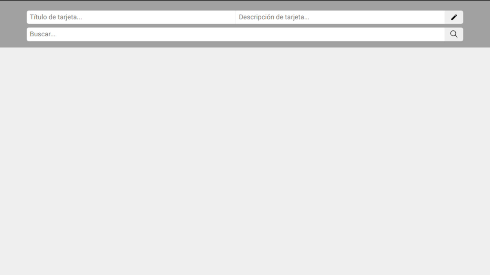
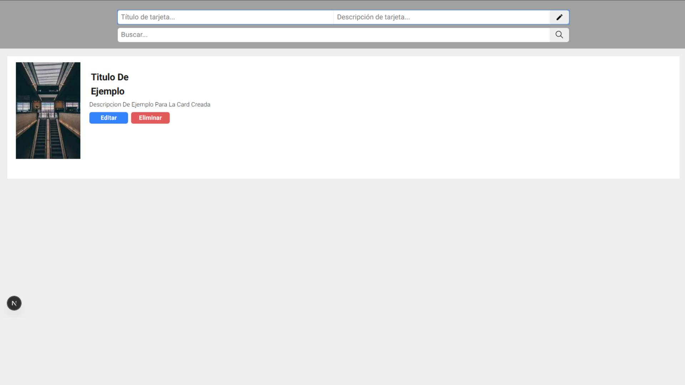
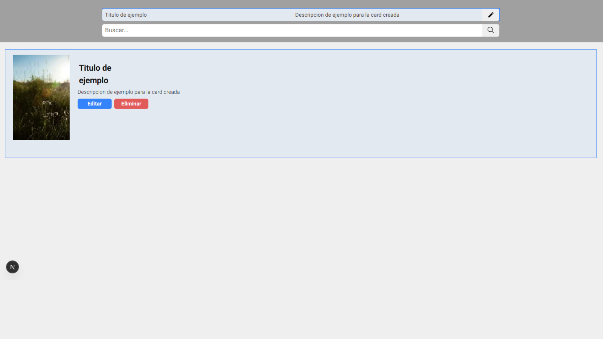

# Prueba Técnica Sooft

Proyecto Frontend para challenge técnico. Aplicación SPA desarrollada en Next.js (React 19) con TypeScript, gestión de estado con Zustand, estilos con Sass (SCSS modules) y pruebas automáticas con Jest y Testing Library.

## Tabla de contenidos

- [Instrucciones](#instrucciones)
- [Stack Tecnológico](#stack-tecnológico)
- [Estructura del Proyecto](#estructura-del-proyecto)
- [Características y Usabilidad](#características-y-usabilidad)
- [Capturas de pantalla](# Capturas-de-pantalla)
- [Escalabilidad](#escalabilidad)
- [Performance](#performance)
- [SEO](#seo)
- [Testing](#testing)

## Instrucciones

1. Clona el repositorio y entra a la carpeta del proyecto.
2. Ejecuta `npm install` para instalar todas las dependencias.
3. Inicia la aplicación con:
	```bash
	npm run dev
	```
	Esto levanta el frontend en [http://localhost:3000](http://localhost:3000).

### Otros scripts útiles

- `npm run build`: build de producción.
- `npm run start`: inicia el build de producción.
- `npm run lint`: corre linter.
- `npm run test`: tests unitarios.

## Stack Tecnológico

**Frontend:**
- Next.js 15 (React 19)
- TypeScript
- Sass (SCSS modules)
- Zustand (state management)

**Testing:**
- Jest, Testing Library (unitarios)

## Estructura del Proyecto

```
├── src/
│   ├── Container/         # Componentes principales y lógica de UI
│   ├── pages/             # Páginas Next.js y API route de ejemplo
│   ├── store/             # Zustand store y tipos
│   └── styles/            # Estilos globales y variables SCSS
├── public/                # Imágenes y assets estáticos
├── __test__/              # Pruebas unitarias
```


## Características y Usabilidad

- **Gestión de tarjetas**: crear, editar, eliminar y buscar tarjetas.
- **Búsqueda en tiempo real** con autogestión de estado.
- **Mensajes personalizados** para errores, sin resultados y bienvenida.
- **Mobile first**: diseño adaptable y responsivo.
- **Edición inline** de tarjetas.
- **Inputs con focus visual** y feedback inmediato.

## Capturas de pantalla

### Pantalla principal (Home)

*Vista principal de la aplicación, donde se listan las tarjetas y se accede a las funciones principales.*

### Crear una tarjeta

*Formulario para crear una nueva tarjeta, con inputs para título y descripción.*

### Editar una tarjeta

*Vista de edición inline de una tarjeta existente, permitiendo modificar sus datos fácilmente.*

## Escalabilidad

- Arquitectura modular: separación clara entre componentes, store y estilos.
- Fácil de extender: agregar nuevas vistas, servicios o features es sencillo.

## Performance

- Data fetching eficiente (sin SSR ni caché, SPA puro).
- Manejo de estado y renderizado optimizado con Zustand.
- Estilos modulares para evitar recarga innecesaria.

## SEO

- Uso de Next.js para estructura optimizada.

## Testing

- Pruebas unitarias con Jest y Testing Library (`npm run test`).
- Mocks de store y componentes para tests confiables.

---

Desarrollado por Emanuel85 para challenge técnico.
